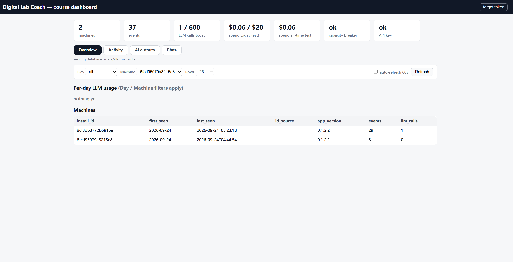
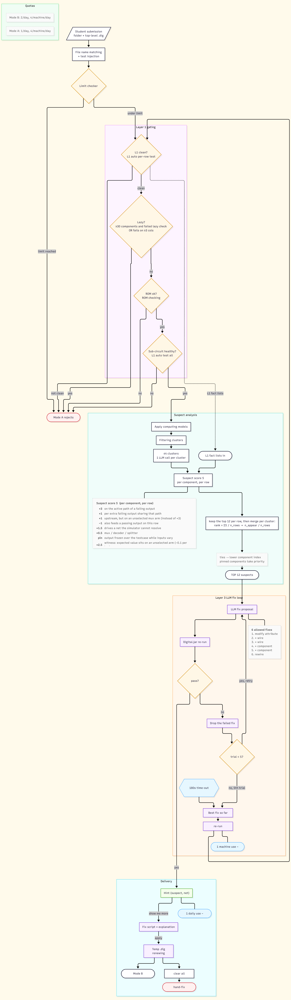

# Digital Lab Coach (DLC)

[](https://github.com/KraLurmumcoelcarix-173/Digital-Lab-Coach-v0.1.2.2/releases/latest/download/DigitalLabCoach.zip)

A hybrid deterministic-checker + LLM feedback tool for debugging
[Digital](https://github.com/hneemann/Digital) circuit labs.
Three layers: structural analysis (Layer 1), conceptual explanation
(Layer 2), and a machine-verified debugging + test-coverage coach
(Layer 3) — every LLM fix proposal is re-run against the official tests
before a student sees it. 

We aim to improve quality and effectiveness of introductory hardware science
education and explore new means of interactive hardware design debugging.


## Status
v0.1.2.2 && 0.1.2.3 (2026/9/23) — Update Both proxy options' set up flow  
v0.1.2.1 (2026/9/17) — Interface available in multi-language && a few small bug fixing.
v0.1.2 (2026/9/10) — Mode A supports higher fixes with optimized latency and cost, signal flow walkthrough feature added in Layer 2.
v0.1.1 (2026/8/24) — Supports 311 Digital transistor lab.
v0.1.0 (2026/8/23) — first packaged release.

## Table of contents

- [Which start flow are you?](#which-start-flow-are-you)
- [Quick start (students)](#quick-start-students)
  - [Working offline](#working-offline)
  - [Telemetry statement](#telemetry-statement)
  - [Uninstalling](#uninstalling)
- [Instructor setup](#instructor-setup)
  - [Tokens, proxy, and hosting](#tokens-proxy-and-hosting)
  - [Changing the limits](#changing-the-limits)
  - [Adapting the course syllabus](#adapting-the-course-syllabus-layer-2-lecture-tags)
  - [Subcircuits as formula models](#subcircuits-as-formula-models-layer-3-mode-a)
  - [The admin dashboard](#the-admin-dashboard)
  - [Rotating the course token](#rotating-the-course-token)
  - [Where to change what](#where-to-change-what)
- [File layout](#file-layout)
- [Design](#design)
- [Developer setup](#developer-setup)
- [Troubleshooting (Windows): Smart App Control](#troubleshooting-windows-uv-run-blocked-by-smart-app-control)
- [Digital.jar for per-row test verification](#developer-optional-setup-digitaljar-for-per-row-test-verification)
- [License](#license)
- [Upstream](#upstream)
- [Acknowledgement](#acknowledgement)

## Which start flow are you?

- **Student in a course using DLC** → Quick start (students) below.
  Your instructor gives you a course-server URL + token — you do NOT
  need any API key.
- **Instructor releasing DLC for a course** → Instructor setup below,
  with the full runbook in
  [docs/RELEASE_GUIDE.md](docs/RELEASE_GUIDE.md).
- **Developer** → Developer setup below.

## Quick start (students)

1. Hit the **Download** button at the top of this page and unzip it anywhere.
2. Windows and macOS/Linux are both supported: inside the unzipped folder, double-click
   **`START_HERE.bat`** on Windows, or run **`./start.sh`** on
   macOS/Linux. The first run installs its own toolchain and takes a
   few minutes; your browser then opens the app at
   `http://127.0.0.1:8765`.

3. Open **Settings (gear icon, top right)**:
   - **Course server**: paste the **URL + course token** from your
     instructor and save; it answers *connected — token accepted ✓*. That
     powers all AI features — no personal API key needed. If your
     instructor announces a new URL or token later, paste it in the same
     place (press **Disconnect** first if an old one is shown).
   - **Language**: pick yours if you wish; the interface switches at once. 
     AI answers stay in English.


4. `Digital.jar`: the first run asks where it is — the same jar you run
   labs with (see the Digital.jar section below if you don't have one). If
   you closed that dialog, it is under **Settings → Digital.jar**.
5. Upload your `.dig` files and start debugging: interactive graph, structural
   issues, per-row tests, signal flow, and the Layer 2/3 AI coach.


### The Layer 2 summary and its walkthrough

Summarize circuit on the L2 Library tab returns six cards. The
subcircuit card lists every child with the lab's one-line role
above what the model says about it. The signal-flow card traces
one real test row and can be played as walkthrough.


### Working offline

Everything deterministic — the graph, structural issues, per-row tests,
signal flow, subcircuit drill-in, the Layer 2 walkthrough — works with no
internet at all. Only the AI coach needs the course-server connection.

### Telemetry Statement

DLC records anonymized usage events (feature clicks, Layer 1 verdicts, test
runs, coach outcomes, and - between two uploads of the same file - how many
components and wires changed and whether the edit touched what the coach had
named; counts and element kinds only, never the circuit itself) keyed to a
hashed machine id only. Related codes are public
and stored at proxy/ and telemetry/, DLC never modifies a student's 
uploaded files. Events sync to the course server for course-improvement research.
This process begins if and only if admin gains IRB permission from the department. 
The first round of experimental use is planned to be shut down around December.

When instructor's proxy server shuts down, DLC's AI features will be offline regardless
of Internet connections. 

Deleting and re-downloading the tool continues the same anonymous record. 

DLC dev team is not responsible for any mis-behaviors of modifying students' files outside 
UNC 311 classroom. You will need IRB permission from your department and work on your own fork
of DLC in order to apply it to student and collect related student data. 

### Uninstalling

Run **`UNINSTALL.bat`** / **`./uninstall.sh`** removes the tool's local
data folder `~/.dlc` and delete the unzipped folder.

## Instructor setup

The detailed version: [docs/RELEASE_GUIDE.md](docs/RELEASE_GUIDE.md):

1. Fork this repository; configure the official test set (and manifest,
   if your labs go beyond the built-ins): step-by-step:
   [docs/MANIFEST_GUIDE.md](docs/MANIFEST_GUIDE.md).
2. Labs whose instruction ROM must hold a fixed course program (loaded
   into an empty ROM for test runs, checked word for word before Mode A):
   [docs/instructor_rom_config.md](docs/instructor_rom_config.md).
3. Generate the two course secrets, deploy the course proxy (holds YOUR
   API key), and hand students your release URL + the proxy URL + course
   token.

### Tokens, proxy, and hosting

Generating the two secrets, starting the proxy on your own laptop or on a
server, finding the address students paste, and the checks to run before
class are one runbook: [docs/RELEASE_GUIDE.md](docs/RELEASE_GUIDE.md)
§2–§4. Use the built-in proxy only with IRB permission from your
department; without a data-collection study, adapt
[`proxy/dlc_proxy.py`](proxy/dlc_proxy.py) to your classroom.

### Changing the limits

| Layer | Counts | Default | Change it in |
|---|---|---|---|
| Per-student daily caps | runs/day, on the student's machine | Mode A 1, Mode B 2 | `CAPS` at the top of [`dlc/l3/limits.py`](dlc/l3/limits.py); the caps only count when the student app runs with `DLC_ENFORCE_LIMITS=1` (the release launchers set it; a developer checkout runs uncapped) |
| Per-machine backstop | LLM calls/day per machine, server-side | modeA 4, modeB 4, grade 2, explain 2 | `CALL_BUDGETS` at the top of [`proxy/dlc_proxy.py`](proxy/dlc_proxy.py) |
| Whole-server circuit breaker | calls/day and estimated $/day, whole class | 600 calls, $20 | env `DLC_GLOBAL_DAILY_CALLS`, `DLC_GLOBAL_DAILY_USD` on the proxy |

A Mode A run only counts against the daily cap when it delivers a
verified card; a refused or empty run is free. More in
[docs/RELEASE_GUIDE.md](docs/RELEASE_GUIDE.md).

### Adapting the course syllabus (Layer 2 lecture tags)

Layer 2 cites lectures from one hard-coded list. When your syllabus
changes (or you fork DLC for another course):

1. Edit `SYLLABUS_311` near the top of
   [`dlc/llm/explain.py`](dlc/llm/explain.py): one line per lecture,
   in the form `Lecture N: topic`. Both the Layer 2 summary and its
   grader tag lectures against this list.
2. Optional: the course name "UNC COMP 311" also appears in the prompt
   headers under [`prompts/`](prompts/) and in `dlc/llm/explain.py`.
3. Restart the server.

### Subcircuits as formula models (Layer 3 Mode A)

Mode A only starts once every subcircuit passes its own tests, so while
it debugs the top circuit it does not simulate a passing child gate by
gate: it evaluates the child's **formula model** instead.

There is nothing to configure for the shipped 311 labs: a model is picked by the
child's interface and is used only after it reproduces every row of that
child's own testcase. A child without a testcase
is simulated as drawn. To name, force or switch off a model per file,
add a `subcircuits` block to the lab manifest — see
[docs/MANIFEST_GUIDE.md](docs/MANIFEST_GUIDE.md); the same block carries
the one-line `role` of each subcircuit. Layer 1's signal flow never uses
models.

Two CPU manifests ship for UNC 311: `data/manifests/cpu.json` for the eight-instruction
Lab 5 subset and `data/manifests/cpu_new.json` for the full 37-instruction
RV32I CPU (`cpu_new.dig` tree). For the RV32I lab the Coverage Coach runs 
the program through a small RV32I interpreter, follows its branches and jumps
and splices any extension in  front of the loop since that program parks in a 
`jal x0, 0` halt loop, where it actually executes.

### The admin dashboard

Open `http://<LAN address>:8321/admin/view`, enter the admin token once:
 machines, per-day activity, per-day LLM usage and estimated spend, 
 breaker state. Raw exports: `/admin/export.csv?table=events|machines|llm_calls`.



### Rotating the course token

Generate a new course token, restart the proxy with it, announce it;
students paste the new token under Settings → Course server.

### Where to change what

Everything an instructor may want to adjust, and the one place it lives.
Restart the server (or the proxy) after changing any of these.

| To change… | Edit / set |
|---|---|
| Daily caps, per-machine budgets, whole-class breaker | the three rows in [Changing the limits](#changing-the-limits) |
| Course token / admin token | proxy env `DLC_COURSE_TOKEN`, `DLC_ADMIN_TOKEN` ([Rotating the course token](#rotating-the-course-token)) |
| Where the proxy keeps its ledger | proxy env `DLC_PROXY_DB` (default `./dlc_proxy.db`) |
| Which model each Layer 3 mode uses | The picker on each Layer 3 board (Sonnet default or Opus, per run). The default behind "Sonnet (default)" comes from env DLC_L3_DEBUG_MODEL/DLC_L3_PROPOSE_MODEL, else the l3_debug_model/l3_propose_modelkeys in~/.dlc/config.json|
| LLM call timeout | env `DLC_LLM_TIMEOUT` (seconds, default 180) |
| Lecture list Layer 2 cites | `SYLLABUS_311` in [`dlc/llm/explain.py`](dlc/llm/explain.py) ([Adapting the course syllabus](#adapting-the-course-syllabus-layer-2-lecture-tags)) |
| Lab categories, subcircuit roles and formula models, program decode | one manifest per lab in [`data/manifests/`](data/manifests/) ([docs/MANIFEST_GUIDE.md](docs/MANIFEST_GUIDE.md))|
| Which files Mode A analyzes even when most rows fail (no lazy gate) | the `no_lazy_gate` list in that lab's manifest; the shipped CPU manifests list the control unit |
| Official tests | Settings ⚙ → Official tests (`~/.dlc/official_tests.json`), shipped defaults in `data/official_tests_defaults.json` |
| The course program a lab's instruction ROM must hold | the `runtime` entry in `data/official_tests_defaults.json` ([docs/instructor_rom_config.md](docs/instructor_rom_config.md)) |
| Solution circuits used to double-check mode B proposals if necessary| env `DLC_REFERENCE_DIR` on YOUR machine only; leave `reference_dir: null` in manifests |
| The formula models themselves | [`dlc/sim/models.py`](dlc/sim/models.py) - one function per known subcircuit, each validated against the child's own testcase before use |
| Digital.jar location | first-run dialog, Settings, or env `DIGITAL_JAR` |
| Release version | `version` in `pyproject.toml` ([docs/RELEASE_GUIDE.md](docs/RELEASE_GUIDE.md)) |

## File layout

| Path | Role |
|---|---|
| `dlc/parser/` | Reads `.dig` XML into structured Python objects: components, wires, nets, signal-flow graph.
| `dlc/facts/` | Extracts a JSON-serializable bundle of facts the LLM and deterministic checkers consume: inventory, per-net widths, per-component topology, structural bug list.
| `dlc/testing/` | Reads each Testcase's embedded test rows out of the `.dig`, parses Digital's CLI output, and pinpoints which specific rows fail - one fast `CLI test -verbose` call per file (with expected-vs-found cells per failing row), falling back to cumulative one-row-at-a-time runs when the fast mapping can't be trusted.
| `dlc/analyzer/` | Deterministic checkers - wire completeness, bit widths, combinational loops, interface conformance, sequential timing. Shallow (top circuit) and deep (whole subcircuit tree) variants.
| `dlc/sim/` | Deterministic value evaluator (`simulator.py`) that computes the value on every net for a test row, with register state for clocked designs and recursive subcircuit evaluation; `models.py` holds the formula models Layer 3 substitutes for passing subcircuits. Powers the signal-flow-on-row-click UI and the subcircuit drill-in.
| `dlc/web/` | FastAPI server (`server.py`) + browser front-end (`static/`) for the web app: interactive graph, structural-issue overlay, per-row test runner, signal-flow-on-row-click, subcircuit drill-in, and the Layer 2/3 coach.
| `dlc/l3/` | Layer 3: Mode A debugger (evidence, clustering, hypothesis verification) and Mode B coverage coach (manifests, program coach, row injection).
| `dlc/llm/` | LLM client wrapper and versioned prompts for conceptual explanation + credibility grading (Layer 2) and strategic debugging (Layer 3).
| `dlc/telemetry/` | Anonymous machine identity, per-interaction logging to a local SQLite spool, and the shipper that syncs it to the course proxy.
| `proxy/` | The course proxy server an instructor deploys: API-key custody, per-machine daily limits (re-download-proof), global daily circuit breaker, telemetry ingest, admin dashboard/summary/export.
| `dlc/cli/` | Command-line entrypoint that wires the layers together.
| `prompts/` | Versioned LLM prompt templates - one file per prompt variant, consumed by `dlc/llm/`.
| `data/manifests/` | One manifest per lab (`cpu.json`, `cpu_new.json`, …): categories, subcircuit roles and models, program decode.
| `data/sample_circuits/` | Test fixtures - public sample circuits and buggy circuits created by the authors. No course answer circuits live in this repository.
| `docs/` | Instructor guides (manifest, ROM payload, release runbook) and screenshots; `docs/dev/` holds developer notes (file-format lore, the Layer 3 contract, manual test snippets, function plan).
| `tests/` | pytest unit tests, one file per source module.
| `START_HERE.bat` / `start.sh` | One-click student launchers
| `UNINSTALL.bat` / `uninstall.sh` | Removes DLC and the local `~/.dlc` data folder.
| `scripts/` | Maintainer utilities - `make_release_zip.py` builds the student release zip.

## Design

Mode A design flow: 

[](docs/screenshots/mode-A-design.png)

## Developer setup

(For best experience, run the setup and testing flow using bash.)

Need Python version >=3.12; 3.12 is best for developing.

**Linux only — install tkinter at the OS level:**
`uv`-managed Python and many distro Pythons don't bundle tkinter.
DLC needs it for the first-run Digital.jar file-picker dialog and
for 3 file-picker tests in the suite. macOS and Windows ship tkinter
with python.org Python — skip this step there.

```bash
# Debian / Ubuntu
sudo apt install python3-tk
# Fedora / RHEL
sudo dnf install python3-tkinter
# Arch
sudo pacman -S tk
```

**General:**
```bash
# Install uv once (skip if already installed)
# macOS / Linux:
curl -LsSf https://astral.sh/uv/install.sh | sh
# Windows PowerShell:
powershell -ExecutionPolicy ByPass -c "irm https://astral.sh/uv/install.ps1 | iex"

# Clone and run tests
git clone <repo-url>
cd digital-lab-coach
uv run pytest
```
After all tests are green you are all set — run the web app with:

```bash
uv sync
uv run python -m dlc.web.server
```

**Side notes**

 1. The shell installer only updates the shell it's run from. If you
    install `uv` via Git Bash but want to use it from PowerShell, run
    the PowerShell installer too.

 2. After install, **close and reopen** your terminal (restart VS Code
    if it still can't find `uv`.)

 3. PowerShell doesn't always parse multi-line `python -c "..."` blocks
    cleanly. For the manual snippets in `docs/dev/test_notes.md`, use Git
    Bash, or save the script to a `.py` file and run `uv run python script.py`.

## Troubleshooting (Windows): `uv run` blocked by Smart App Control

**Symptom** — `uv run python ...` fails *before* the app starts:

```
error: Failed to spawn: `python`
  Caused by: ... (os error 4551)
# or, after forcing a system Python:
Querying Python at `...\WindowsApps\python3.exe` failed (exit code 0x800711c7)
```

`os error 4551`:
an application control policy has blocked this file. Windows 11's **Smart App
Control** can switch itself from Evaluation to On (e.g. after an update),
and then it blocks unsigned executables — including the Python `uv` downloads
(python-build-standalone) and the Microsoft Store `python3.exe` alias stub. A
`.venv` built on a now-blocked interpreter stops launching too. This is an
environment/OS block.

**Fix — install a *signed* Python and rebuild the venv:**

1. **Disable the Store alias stubs** so they stop shadowing the real Python:
   Settings → Apps → Advanced app settings → App execution aliases → turn
   **off** `python.exe`, `python3.exe` and `pythonw.exe`.
2. **Install a signed Python 3.12** from <https://www.python.org> (PSF-signed;
   tick "Add python.exe to PATH"). Verify it isn't blocked: `python --version`.
   If Smart App Control still blocks it, install **Python 3.12 from the
   Microsoft Store** instead — Store apps are always trusted by Smart App Control.
3. **Delete the dead venv and rebuild** against the signed Python (Git Bash):

```bash
rm -rf .venv
uv venv --python "C:/Users/<you>/AppData/Local/Programs/Python/Python312/python.exe"
uv sync
uv run python -m dlc.web.server
```

Don't turn Smart App Control *off* to fix this — it is one-way (you can't
re-enable it without reinstalling Windows). Use a signed Python instead.


## Developer Optional setup: Digital.jar for per-row test verification

DLC's structural analysis works on any `.dig` file with no extra setup.

**For per-row pass/fail diagnostics and failing test analysis**, the tool
runs Digital's CLI as a subprocess, so it needs to know where your `Digital.jar` is.

### Setting it up
Download Digital from
<https://github.com/hneemann/Digital>, extract anywhere, and let the first-run dialog find your jar.

If you'd rather configure it manually:

```bash
# Option A
uv run python -c "from dlc.testing.config import set_digital_jar_path; set_digital_jar_path(r'PATH_TO_YOUR_Digital.jar')"

# Option B
# macOS / Linux
export DIGITAL_JAR=/path_to_Digital/Digital.jar
# Windows PowerShell
$env:DIGITAL_JAR = "C:\path_to_Digital\Digital.jar"
```

## License

GPL-3.0. See LICENSE.

## Upstream

Built to read .dig files produced by [Digital](https://github.com/hneemann/Digital),
an open-source educational circuit simulator (GPL-3.0).

## Acknowledgement 

Great thanks to UNC 2025 - 2026 Comp 311 team and all 311 instructors

Great thanks to hneemann


